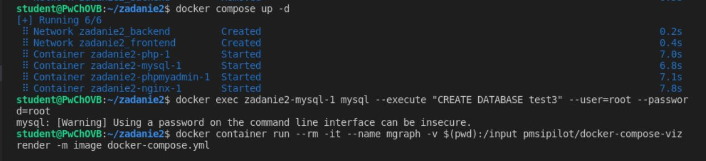
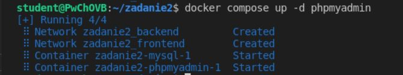
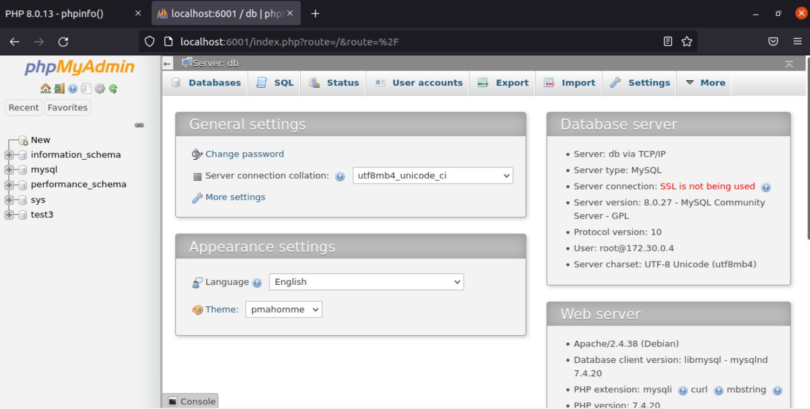
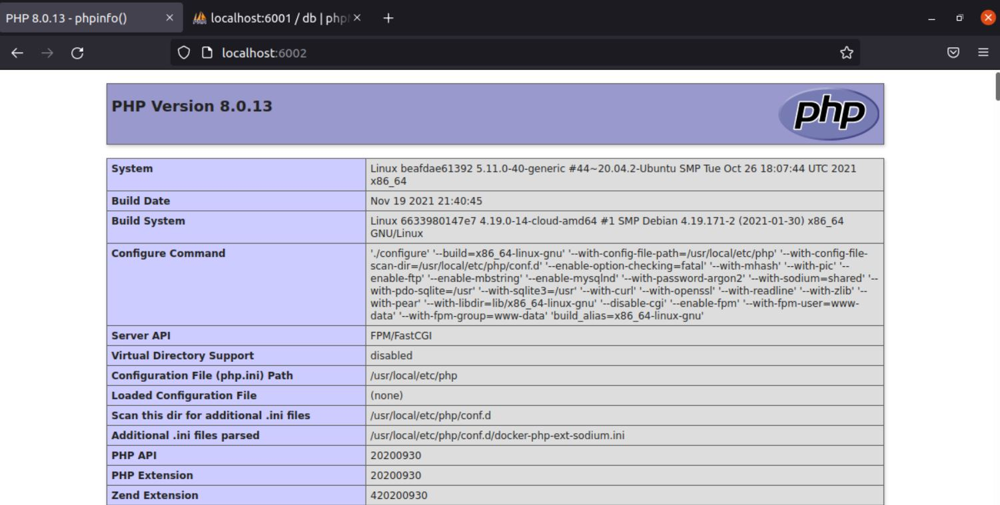
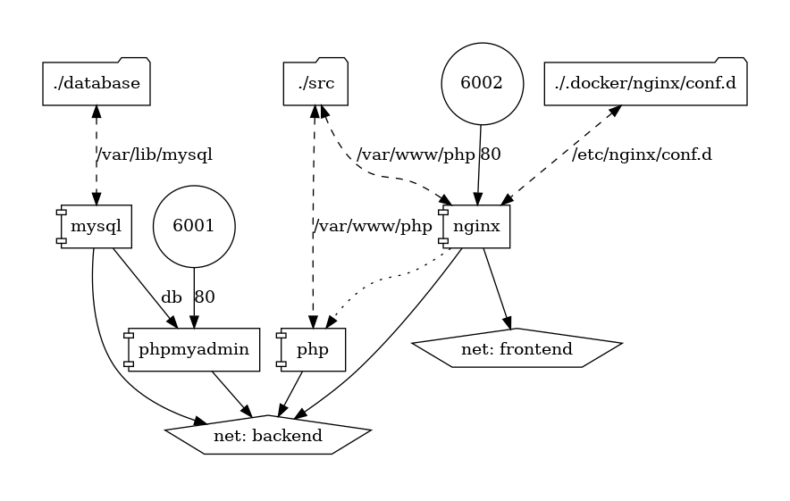

# Zadanie 2

Polecenie uruchamiające stack: ```docker compose up -d```

Polecenie uruchamiające phpMyAdmin: ```docker compose up -d phpmyadmin```

Polecenie tworzące testową bazę test3: ```docker exec zadanie2-mysql-1 mysql --execute "CREATE DATABASE test3" --user=root --password=root```

Polecenie generujące plik ilustrujący strukturę projektu: ```docker container run --rm -it --name mgraph -v $(pwd):/input pmsipilot/docker-compose-viz render -m image docker-compose.yml```





PhpMyAdmin:



Strona index.php



Struktura projektu:


